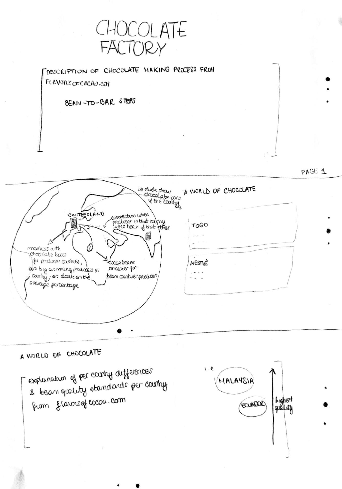
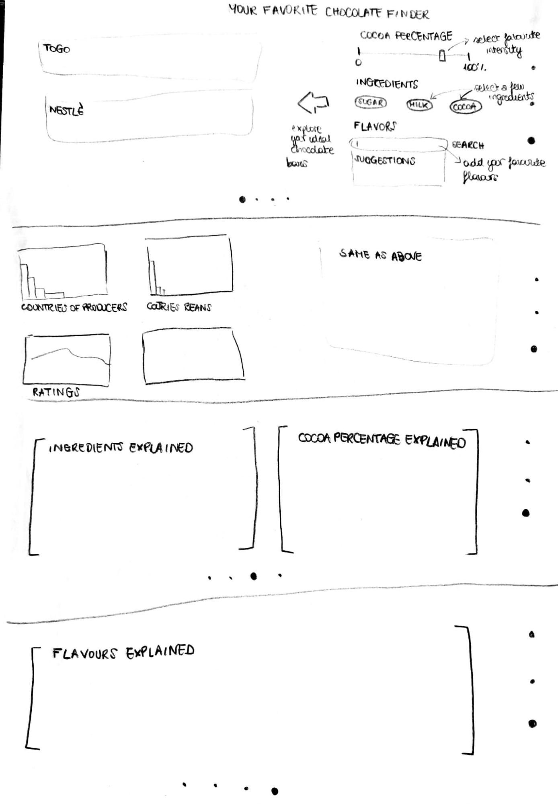

# datavis-project-2022-clr

# Project of Data Visualization (COM-480)

For this project, we wish to showcase the magical world of chocolate. 

| Student's name | SCIPER |
| -------------- | ------ |
| Ludovica Schaerf | 323137 |
| Carlo Refice   | 328287 |
| Ahmad ElRouby   | 337820 |

[Milestone 1](#milestone-1) • [Milestone 2](#milestone-2) • [Milestone 3](#milestone-3)

## Milestone 1

**10% of the final grade**

### 1. Dataset

*Find a dataset (or multiple) that you will explore. Assess the quality of the data it contains and how much preprocessing / data-cleaning it will require before tackling visualization. We recommend using a standard dataset as this course is not about scraping nor data processing.*

We decided to evaluate mainly three publicly available datasets that were found on Kaggle. All of the datasets contain 1000-2000 ratings of chocolate bars alongside some matedata on the latter.
The first, and most promising, one was created by Manhattan Chocolate Society, Flavors of Cacao [Internet]. Available from: [here](http://flavorsofcacao.com/). The dataset was last updated three months ago and code for crawling the most up-to-date information from the website was published alongside the data ([script](https://www.kaggle.com/code/andrewmvd/chocolate-ratings-crawler)). As most datasets, the available data is USA/Canada centric, with specific information only about companies in the two countries (but ratings of companies from around the world). The website [http://flavorsofcacao.com/](http://flavorsofcacao.com/) appears very trustworthy and thorough. It contains the data that is available on the dataset plus lots of informative studies and surveys on chocolate that were conducted by the Manhattan Chocolate Society and might be nice to include to our website as well. 
The second and third datasets are less up to date and contain fewer metadata fields. These were all retrieved from the same website, only 5 and 2 years before. For this reason, we decide to focus on the first.

The dataset is very clean: the missing fields are very few, and the only preprocessing required will be a merging of the two datasets and some processing on columns that contain list information (i.e. list of ingredients written as 'ingredient1, ingredient2').

### 2. Problematic

*Frame the general topic of your visualization and the main axis that you want to develop. What am I trying to show with my visualization? Think of an overview for the project, your motivation, and the target audience.*

We will shed light on the elements that contribute to creating the perfect chocolate bar, be it the bean, the company, the flavour and so on.

Switzerland is renowned for its chocolate production. The quality, the variety and the taste have given it the reputable position that it currently possesses. However, many of us have been eating chocolate without really knowing where it came from and the process involved in its production. We aim to provide users who are passionate about chocolate the opportunity to find out more about their favorite chocolate bars in a visually interactive way. In our project, we will allow users to find out the origins of any chocolate manufacturer as well as the type of beans and their country of origin for a given chocolate bar. Finally, we will allow users to input their own recipes for a chocolate of their imagination and provide them with feedback based on aggregates from ratings given by others according to the company origin, flavors, bean origin, how dark the bean is and how it's liked by people across the globe. 


### 3. Exploratory Analysis

Please refer to our [Jupyter Notebook](./Milestone%201%20Data%20Analysis.ipynb) for the analysis. 

### 4. Related Work

Most [related work on Kaggle](https://www.kaggle.com/search?q=chocolate+bar+ratings+in%3Anotebooks+tags%3A%22data+visualization%22) is mostly limited to exploratory data analysis, with some notable projects trying to predict a chocolate bar's rating based on e.g. its cocoa percentage or ingredients. Some interesting graphs on relationships between cocoa bean origins and processing countries were found [in this notebook on Kaggle.](https://www.kaggle.com/code/tibhar940/chocolate-bar-ratings-python-eda-dataviz). We are not aware of any other project using this dataset for informative purposes, especially not ones with an interactive visualization.

We were particularly inspired by the beatufiful look and informative nature of the [Wine Journey](https://com-480-data-visualization.github.io/com-480-project-onvagagner/website/) project from this same course. We also want to put a unique twist on the visual theme, perhaps using Charlie and the Chocolate factory as an inspiration.


## Milestone 2 

### Sketches

The following are hand-drawn sketches showing the general outline of our website, one for each "main" visualization.





### Tools / Lectures

We will mostly stick to using D3 for our project. We will be using most basic D3 features as described in the "D3" and "Interactive D3" lectures
such as creating html and svg elements for each item in our dataset and displaying time-series data.
We will also show geographical data on a globe using information shown in the "Maps" and "Practical Maps" features.

As for the website's styling, we could either create it from scratch, or use a framework such as bootstrap, based on the amount of time we have available to finish the project.

### Goal breakdown

We have identified two independent main pieces that should make up our final visualization, and came up with some further ideas that could be nice to implement if time allows.

#### Core visualization

* __A World of Chocolate__: Since with our website we want to describe the process of the making of chocolate, one of the central parts will be outlining the relationships between cocoa producers and chocolate manufacturers. Both of these will be shown as points on a globe (with either a cocoa bean or chocolate bar icon, respectively), with arcs between them representing an import-export relationship. The size of the points and the width of the arcs will be proportional to the amount of chocolate bars in our dataset that are either produced in or with cocoa obtained from their location. This will give a good general overview of the global production of chocolate and import-export of cocoa.

Clicking on a location will bring up a list of cards to the right of the globe, one for each chocolate bar that has a relationship (production or harvesting) with that location, showing more information such as company name, main characteristics and ingredients, cocoa percentage, and their average score based on reviews.

More general information about how a bar's characteristics influence its rating will be shown on a separate element below. (@Ludovica I think this is an extra, if so feel free to move this paragraph to that section or smth).

* __Create Your Favorite Bar__: Given the amount of data we have regarding chocolate bars, the ingredients used for their production, the characteristics related to each bar, and the overall rating, we have decided to provide the user with the capability of creating their very own chocolate bar.

The user is able to provide some information about a chocolate bar they have always wanted to try. This information describes the percentage of cocoa used in that bar, the main ingredients they'd like to use (we're currently using a set of ingredients that we have gathered from the datasets). The user also supplies 5 characteristics they'd like to have in their bar. Finally, by correlating the provided information with the data we have, we provide the user with the top 5 bars that match their preferences.

In order to obtain these results, we define a distance function from the user's data and each bar which assigns a score based on a set of factors defined by us. The factors are easily changed and will be experimented further to find the best set of factors.

As for the cocoa percentage, the absolute difference is used. As for the ingredients, we're giving higher score to bars that match more ingredients provided by the users. However, since we have a big list of characteristics for chocolate bars, we have decided to use two different methods for calculating the score. The first function matches the ingredients and just bases the score on the common elements between the bar and the user data. The other method depends using word embeddings to provide more context while choosing the bar that is closest to the user's preferences without having to match literal text. We are currently providing the user with the option to use anyone of them.

For the next phase we'd like to test how accurate our scoring function and suggestion engine. We will try to mimic real users and provide more examples to see how the function performs.

Finally, we will use the the results of this experiment to provide the user with an analytical visual representation of their choices as compared to other bars and how each of them was rated and our predicted likeability of their bar.

#### Extra ideas (__Ludovica__)

### Demo
You can preview our project [on GitHub pages.](https://com-480-data-visualization.github.io/datavis-project-2022-clr/)


## Milestone 3 

**80% of the final grade**

<details><summary><b>Technical Setup</b></summary>
For project:

#### Project setup
``` ```


</details>

- [Website]()
- [Process book]()
- [Screencast]()

